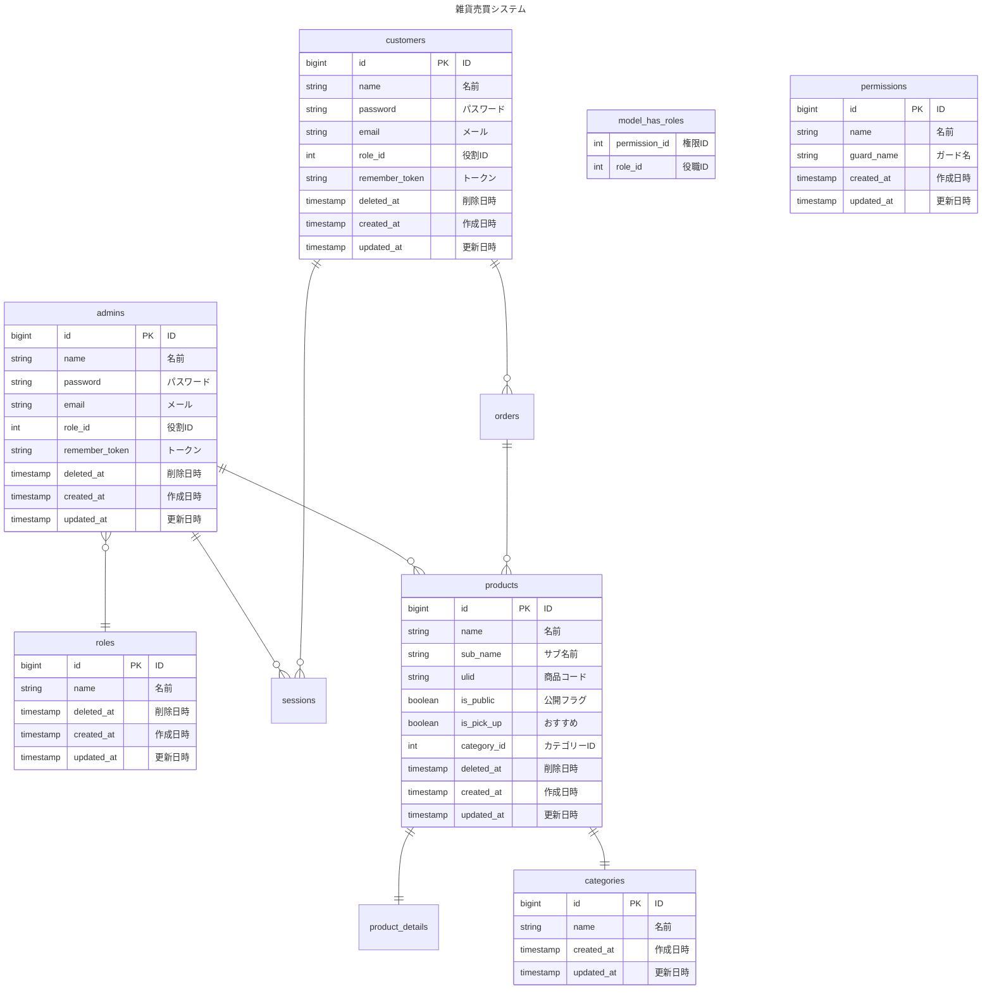

# ER図

```mermaid
---
title: "雑貨売買システム"
---
erDiagram
    admins }o--|| roles: ""
    admins ||--o{ sessions: ""
    admins ||--o{ products: ""
    products ||--|| product_details: ""
    products ||--|| categories: ""
    orders ||--o{ products: ""
    customers ||--o{ sessions: ""
    customers ||--o{ orders: ""

    

    admins {
        bigint id PK "ID"
        string name "名前"
        string password "パスワード"
        string email "メール"
        int role_id "役割ID"
        string remember_token "トークン"
        timestamp deleted_at "削除日時"
        timestamp created_at "作成日時"
        timestamp updated_at "更新日時"
    }

    customers {
        bigint id PK "ID"
        string name "名前"
        string password "パスワード"
        string email "メール"
        int role_id "役割ID"
        string remember_token "トークン"
        timestamp deleted_at "削除日時"
        timestamp created_at "作成日時"
        timestamp updated_at "更新日時"
    }

    roles {
      bigint id PK "ID"
      string name "名前"
      timestamp deleted_at "削除日時"
      timestamp created_at "作成日時"
      timestamp updated_at "更新日時"
    }

    model_has_roles {
      int permission_id "権限ID"
      int role_id "役職ID"
    }

    permissions {
      bigint id PK "ID"
      string name "名前"
      string guard_name "ガード名"
      timestamp created_at "作成日時"
      timestamp updated_at "更新日時"
    }

    orders {

    }

    products {
      bigint id PK "ID"
      string name "名前"
      string sub_name "サブ名前"
      string ulid "商品コード"
      boolean is_public "公開フラグ"
      boolean is_pick_up "おすすめ"
      int category_id "カテゴリーID"
      timestamp deleted_at "削除日時"
      timestamp created_at "作成日時"
      timestamp updated_at "更新日時"
    }

    categories {
      bigint id PK "ID"
      string name "名前"
      timestamp created_at "作成日時"
      timestamp updated_at "更新日時"
    }

    product_details {
      
    }
```
